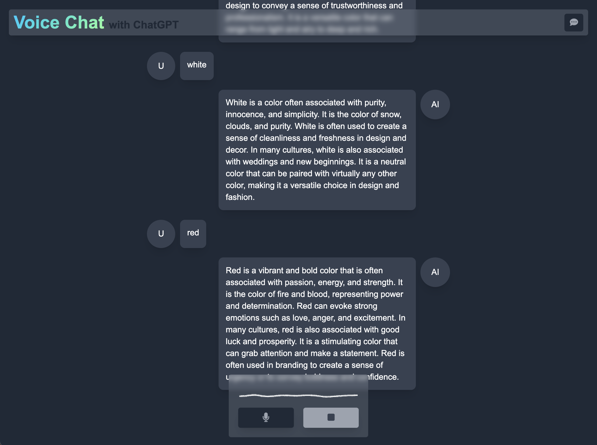
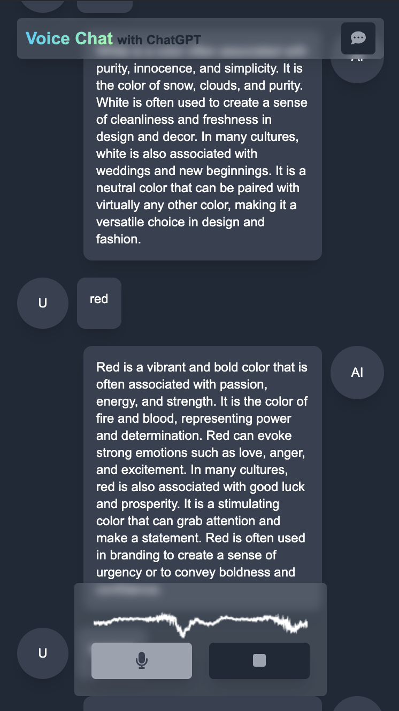

## Voice Chat Middleware for ChatGPT

<div style="display:flex;width:100%;align-items:flex-start;justify-content:space-between;">


</div>

This project is a Vue 3 application built with TypeScript and Vite, designed to act as a middleware for voice-based interactions with the ChatGPT API. Users can speak their questions into the application, which will then transcribe their speech into text, send it to the ChatGPT API, and play back the response using speech synthesis. This allows for a seamless voice-to-voice interaction with ChatGPT.

### Features

- **Voice Selector**: Select synthesized voice persona.
- **Voice to Text**: Capture user's voice using the Web Speech API and transcribe it into text.
- **ChatGPT API Integration**: Send transcribed text to the ChatGPT API and receive a response.
- **Text to Speech**: Convert the ChatGPT response back to speech using the Web Speech API.
- **Modern Front-End Stack**: Built with Vue 3, TypeScript, and Vite for a fast, efficient, and scalable application.
- **Tailwind CSS**: Utilizes Tailwind CSS for responsive and customizable UI components.

### Technologies Used

- **Vue 3**: A progressive JavaScript framework for building user interfaces.
- **TypeScript**: A typed superset of JavaScript that compiles to plain JavaScript.
- **Vite**: A build tool that provides a faster and leaner development experience for modern web projects.
- **Axios**: A promise-based HTTP client for making API requests.
- **Web Speech API**: Browser APIs for speech recognition and speech synthesis.
- **Tailwind CSS**: A utility-first CSS framework for rapidly building custom user interfaces.

### Installation and Setup

1. **Clone the repository**:

   ```sh
   git clone https://github.com/nbursa/vue-voice-chat.git
   cd vue-voice-chat
   ```

2. **Install dependencies**:

   ```sh
   yarn install
   ```

3. **Start the development server**:

   ```sh
   yarn dev
   ```

4. **Build the project for production**:

   ```sh
   yarn build
   ```

5. **Lint and fix the project**:

   ```sh
   yarn lint
   ```

6. **Perform type checking**:

   ```sh
   yarn type-check
   ```
